## Technical Documentation: Reward and Request System

This document provides a comprehensive overview of the reward and request system, detailing its architecture, workflows, and implementation. This system allows users to earn, redeem, and request rewards within the application.

### 1. System Overview

The reward and request system facilitates the creation, management, and redemption of rewards. Users can earn points, which they can then use to redeem rewards offered by other users. The system also includes a request mechanism, allowing users to request rewards from other users. Key features include:

*   **Reward Creation:** Users can create and offer rewards to other users.
*   **Reward Redemption:** Users can redeem rewards using their accumulated points.
*   **Request Mechanism:** Users can request rewards from other users.
*   **Transaction History:** Users can view their transaction history, including points earned and rewards redeemed.
*   **Category Management:** Rewards are categorized for easier browsing and management.
*   **Authentication and Authorization:** Secure access to reward functionalities based on user roles and permissions.
*   **Rate Limiting:** Protection against abuse through rate limiting on critical endpoints.
*   **Error Handling:** Robust error handling and logging for debugging and monitoring.

### 2. Technical Architecture

The system is built using a layered architecture, comprising the following components:

*   **Client-Side (React):** Provides the user interface for interacting with the system.
*   **Server-Side (Express.js):** Handles API requests, business logic, and data persistence.
*   **Database (MongoDB):** Stores reward, user, transaction, and category data.
*   **Middleware:** Provides authentication, authorization, rate limiting, and error handling.

The following diagram illustrates the high-level architecture of the system:


**Explanation:**

*   The client application interacts with the backend through the API Gateway.
*   The API Gateway routes requests to the appropriate services.
*   Each service interacts with its corresponding database.
*   The Authentication Service handles user authentication and authorization.

### 3. Key Components and Their Interactions

#### 3.1. `express.d.ts`

This file extends the Express `Request` interface to include user information after authentication.

```typescript
import { Request } from 'express';

declare global {
    namespace Express {
        interface Request {
            user?: {
                userId: string;
            }
        }
    }
}
```

**Explanation:**

*   This declaration allows middleware like `auth` to attach user information to the `Request` object, making it accessible in subsequent route handlers.
*   The `user` property is optional (`user?`) to handle unauthenticated requests gracefully.

#### 3.2. `transaction.routes.ts` and `transactionController.ts`

These files define the routes and controller logic for handling transaction-related operations, specifically retrieving transaction history.

**`transaction.routes.ts`:**

```typescript
import express from 'express';
import { auth } from '../middleware/auth';
import { getTransactionHistory } from '../controllers/transactionController';

const router = express.Router();

router.get('/history', auth, getTransactionHistory);
```

**`transactionController.ts`:**

```typescript
import { Response } from 'express';
import { AuthRequest } from '../middleware/auth';
import { Transaction } from '../models/transaction.model';

export const getTransactionHistory = async (req: AuthRequest, res: Response) => {
    try {
        const userId = req.user?.userId;

        if (!userId) {
            return res.status(401).json({ message: 'User not authenticated' });
        }

        const transactions = await Transaction.find({
            $or: [
                { fromUser: userId },
                { toUser: userId }
            ]
        })
        .populate('reward', 'title points code description')
        .populate('fromUser', 'name')
        .populate('toUser', 'name')
        .sort({ createdAt: -1 })
        .exec();

        res.json(transactions);
    } catch (error: any) {
        console.error('Error fetching transaction history:', error);
        res.status(500).json({ message: 'Failed to fetch transaction history' });
    }
};
```

**Explanation:**

*   `transaction.routes.ts` defines a route `/history` that is protected by the `auth` middleware.
*   `getTransactionHistory` in `transactionController.ts` retrieves the transaction history for the authenticated user.
*   It uses `Transaction.find` to query the database for transactions where the user is either the sender (`fromUser`) or receiver (`toUser`).
*   The `populate` method is used to retrieve related data from the `reward`, `fromUser`, and `toUser` collections.

#### 3.3. `rewardRoutes.ts` and `rewardController.ts`

These files define the routes and controller logic for managing rewards.

**`rewardRoutes.ts`:**

```typescript
import express from 'express';
import { auth, AuthRequest } from '../middleware/auth';
import { 
    createReward, 
    getRewardById, 
    updateReward, 
    deleteReward,
    redeemReward,
    getAllRewards,
    getAllAvailableRewards,
    getMyRewards 
} from '../controllers/rewardController';

const router = express.Router();

router.get('/', getAllRewards);
router.get('/available', getAllAvailableRewards);
router.get('/user/my-rewards', auth, getMyRewards);
router.get('/:id', getRewardById);
router.post('/', auth, createReward);
router.put('/:id', auth, updateReward);
router.delete('/:id', auth, deleteReward);
router.post('/redeem/:id', auth, redeemReward);
```

**`rewardController.ts`:**

```typescript
import { Request, Response } from 'express';
import { Reward } from '../models/reward.model';
import type { AuthRequest } from '../middleware/auth';
import mongoose from 'mongoose';
import { User } from '../models/user.model';
import{ Transaction } from '../models/transaction.model';

export const getAllRewards = async (req: Request, res: Response) => {
    try {
        const rewards = await Reward.find()
            .populate('owner', 'name email')
            .populate('category', 'name slug icon')
            .exec();

        if (!rewards) {
            return res.status(404).json({ message: 'No rewards found' });
        }

        res.json(rewards);
    } catch (error: any) {
        console.error('Error in getAllRewards:', error);
        res.status(500).json({ 
            message: 'Failed to fetch rewards',
            error: error.message 
        });
    }
};

export const getMyRewards = async (req: AuthRequest, res: Response) => {
    try {
        const userId = req.user?.userId;
        
        if (!userId) {
            return res.status(401).json({ message: 'User not authenticated' });
        }

        const rewards = await Reward.find({ owner: userId })
            .populate('owner', 'name email')
            .populate('category', 'name slug icon')
            .exec();

        res.json(rewards);

    } catch (error: any) {
        console.error('Error fetching my rewards:', error);
        res.status(500).json({ 
            message: 'Failed to fetch rewards',
            error: error.message 
        });
    }
};

export const getAllAvailableRewards = async (req: Request, res: Response) => {
    try {
        const rewards = await Reward.find({ status: 'available' })
            .populate('owner', 'name email')
            .populate('category', 'name slug icon')
            .exec();

        res.json(rewards);
    } catch (error: any) {
        console.error('Error in getAllAvailableRewards:', error);
        res.status(500).json({ 
            message: 'Failed to fetch available rewards',
            error: error.message 
        });
    }
};

export const createReward = async (req: AuthRequest, res: Response) => {
    try {
        if (req.body.category) {
            if (!mongoose.Types.ObjectId.isValid(req.body.category)) {
                return res.status(400).json({
                    message: 'Invalid category ID'
                });
            }
        }
        
        const { title, description, points, code, category, imageUrl } = req.body;
        const userId = req.user?.userId;

        const reward = new Reward({
            title,
            description,
            points,
            code,
            owner: userId,
            category,
            imageUrl
        });

        await reward.save();
        res.status(201).json(reward);

    } catch (error: any) {
        console.error('Error creating reward:', error);
        
        if (error.name === 'ValidationError') {
            const errors: Record<string, string> = {};
            
            Object.keys(error.errors).forEach(key => {
                errors[key] = error.errors[key].message;
            });

            return res.status(400).json({
                message: 'Validation failed',
                errors
            });
        }

        if (error.code === 11000) {
            return res.status(400).json({
                message: 'Duplicate value error',
                errors: {
                    [Object.keys(error.keyPattern)[0]]: 'This value already exists'
                }
            });
        }

        res.status(500).json({ 
            message: 'Error creating reward',
            error: process.env.NODE_ENV === 'development' ? error.message : undefined
        });
    }
};

export const getRewardById = async (req: AuthRequest, res: Response) => {
  try {
    const reward = await Reward.findById(req.params.id)
      .populate('owner', 'name email');
    
    if (!reward) {
      return res.status(404).json({ message: 'Reward not found' });
    }
    
    res.json(reward);
  } catch (error) {
    res.status(500).json({ message: 'Error fetching reward' });
  }
};

export const redeemReward = async (req: AuthRequest, res: Response) => {
    try {
        const rewardId = req.params.id;
        const redeemingUserId = req.user?.userId;

        if (!redeemingUserId) {
            return res.status(401).json({ message: 'User not authenticated' });
        }

        const reward = await Reward.findById(rewardId);
        if (!reward) {
            return res.status(404).json({ message: 'Reward not found' });
        }

        const [redeemingUser, ownerUser] = await Promise.all([
            User.findById(redeemingUserId),
            User.findById(reward.owner)
        ]);

        if (!redeemingUser || !ownerUser) {
            console.log('User not found:', { redeemingUser: !!redeemingUser, ownerUser: !!ownerUser });
            return res.status(404).json({ message: 'User not found' });
        }

        if (redeemingUser.points < reward.points) {
            console.log('Insufficient points:', {
                userPoints: redeemingUser.points,
                rewardPoints: reward.points
            });
            return res.status(400).json({ message: 'Insufficient points' });
        }

        redeemingUser.points -= reward.points;
        ownerUser.points += reward.points;

        reward.status = 'redeemed';

        const transaction = new Transaction({
            fromUser: redeemingUserId,
            toUser: reward.owner,
            reward: rewardId,
            points: reward.points,
            type: 'redeem'
        });

        await Promise.all([
            redeemingUser.save(),
            ownerUser.save(),
            reward.save(),
            transaction.save()
        ]);

        res.json({ message: 'Reward redeemed successfully' });

    } catch (error: any) {
        console.error('Error redeeming reward:', error);
        res.status(500).json({ 
            message: 'Failed to redeem reward',
            error: error.message 
        });
    }
};

export const updateReward = async (req: AuthRequest, res: Response) => {
    try {
        const reward = await Reward.findById(req.params.id);
        
        if (!reward) {
            return res.status(404).json({ message: 'Reward not found' });
        }

        if (reward.owner.toString() !== req.user?.userId) {
            return res.status(403).json({ message: 'Not authorized to update this reward' });
        }

        const updatedReward = await Reward.findByIdAndUpdate(req.params.id, req.body, { new: true });

        res.json(updatedReward);
    } catch (error) {
        console.error('Error updating reward:', error);
        res.status(500).json({ message: 'Error updating reward' });
    }
};

export const deleteReward = async (req: AuthRequest, res: Response) => {
    try {
        const reward = await Reward.findById(req.params.id);
        
        if (!reward) {
            return res.status(404).json({ message: 'Reward not found' });
        }

        if (reward.owner.toString() !== req.user?.userId) {
            return res.status(403).json({ message: 'Not authorized to delete this reward' });
        }

        await Reward.findByIdAndDelete(req.params.id);
        res.json({ message: 'Reward deleted successfully' });
    } catch (error) {
        console.error('Error deleting reward:', error);
        res.status(500).json({ message: 'Error deleting reward' });
    }
};
```

**Explanation:**

*   `rewardRoutes.ts` defines various routes for reward management, including fetching, creating, updating, deleting, and redeeming rewards.
*   Several routes are protected by the `auth` middleware, ensuring that only authenticated users can access them.
*   `rewardController.ts` implements the logic for each of these routes.
*   `getAllRewards`, `getAllAvailableRewards`, and `getMyRewards` fetch rewards based on different criteria.
*   `createReward` creates a new reward, associating it with the authenticated user.
*   `getRewardById` retrieves a specific reward by its ID.
*   `redeemReward` handles the reward redemption process, updating user points and creating a transaction record.
*   `updateReward` and `deleteReward` allow users to modify or remove their own rewards.

#### 3.4. `requestRoutes.ts` and `requestController.ts`

These files define the routes and controller logic for handling reward requests.

**`requestRoutes.ts`:**

```typescript
import express from 'express';
import { 
  createRequest,
  getMyRequests,
  respondToRequest,
  getRequestById
} from '../controllers/requestController';
import { auth } from '../middleware/auth';

const router = express.Router();

router.post('/:rewardId', auth, createRequest);
router.get('/my-requests', auth, getMyRequests);
router.get('/:id', auth, getRequestById);
router.post('/:id/respond', auth, respondToRequest);
```

**`requestController.ts`:**

```typescript
import { Request, Response } from 'express';
import ExchangeRequest from '../models/Request';
import { Reward } from '../models/reward.model';
import mongoose from 'mongoose';

interface AuthRequest extends Request {
  userId?: string;
}

export const createRequest = async (req: AuthRequest, res: Response) => {
  const session = await mongoose.startSession();
  session.startTransaction();

  try {
    const reward = await Reward.findById(req.params.rewardId);
    
    if (!reward) {
      return res.status(404).json({ message: 'Reward not found' });
    }

    if (reward.status !== 'available') {
      return res.status(400).json({ message: 'Reward is not available' });
    }

    if (reward.owner.toString() === req.userId) {
      return res.status(400).json({ message: 'Cannot request your own reward' });
    }

    const existingRequest = await ExchangeRequest.findOne({
      reward: req.params.rewardId,
      sender: req.userId,
      status: 'pending'
    });

    if (existingRequest) {
      return res.status(400).json({ message: 'Request already exists' });
    }

    const request = new ExchangeRequest({
      reward: req.params.rewardId,
      sender: req.userId,
      receiver: reward.owner,
      status: 'pending'
    });

    await request.save({ session });
    reward.status = 'pending';
    await reward.save({ session });

    await session.commitTransaction();
    
    res.status(201).json(request);
  } catch (error) {
    await session.abortTransaction();
    res.status(400).json({ message: 'Error creating request' });
  } finally {
    session.endSession();
  }
};

export const getMyRequests = async (req: AuthRequest, res: Response) => {
  try {
    const sentRequests = await ExchangeRequest.find({ sender: req.userId })
      .populate('reward')
      .populate('receiver', 'name email');

    const receivedRequests = await ExchangeRequest.find({ receiver: req.userId })
      .populate('reward')
      .populate('sender', 'name email');

    res.json({
      sent: sentRequests,
      received: receivedRequests
    });
  } catch (error) {
    res.status(500).json({ message: 'Error fetching requests' });
  }
};

export const getRequestById = async (req: AuthRequest, res: Response) => {
  try {
    const request = await ExchangeRequest.findOne({
      _id: req.params.id,
      $or: [{ sender: req.userId }, { receiver: req.userId }]
    })
      .populate('reward')
      .populate('sender', 'name email')
      .populate('receiver', 'name email');

    if (!request) {
      return res.status(404).json({ message: 'Request not found' });
    }

    res.json(request);
  } catch (error) {
    res.status(500).json({ message: 'Error fetching request' });
  }
};

export const respondToRequest = async (req: AuthRequest, res: Response) => {
  const session = await mongoose.startSession();
  session.startTransaction();

  try {
    const request = await ExchangeRequest.findOne({
      _id: req.params.id,
      receiver: req.userId,
      status: 'pending'
    });

    if (!request) {
      return res.status(404).json({ message: 'Request not found' });
    }

    const { response } = req.body;
    if (!['accepted', 'rejected'].includes(response)) {
      return res.status(400).json({ message: 'Invalid response' });
    }

    request.status = response;
    await request.save({ session });

    const reward = await Reward.findById(request.reward);
    if (!reward) {
      throw new Error('Reward not found');
    }

    reward.status = response === 'accepted' ? 'exchanged' : 'available';
    await reward.save({ session });

    if (response === 'rejected') {
      // Cancel other pending requests for this reward
      await ExchangeRequest.updateMany(
        {
          reward: request.reward,
          status: 'pending',
          _id: { $ne: request._id }
        },
        { status: 'rejected' },
        { session }
      );
    }

    await session.commitTransaction();
    res.json(request);
  } catch (error) {
    await session.abortTransaction();
    res.status(400).json({ message: 'Error responding to request' });
  } finally {
    session.endSession();
  }
};
```

**Explanation:**

*   `requestRoutes.ts` defines routes for creating, retrieving, and responding to reward requests.
*   `createRequest` in `requestController.ts` creates a new request for a reward. It checks if the reward is available and if the user is not requesting their own reward. It also ensures that a user cannot create multiple pending requests for the same reward.
*   `getMyRequests` retrieves the requests sent and received by the authenticated user.
*   `getRequestById` retrieves a specific request by its ID, ensuring that the user is either the sender or receiver of the request.
*   `respondToRequest` allows the receiver of a request to accept or reject it. If accepted, the reward status is updated to 'exchanged'. If rejected, the reward status is updated to 'available', and other pending requests for the same reward are rejected.

#### 3.5. `category.routes.ts`

This file defines the routes for managing reward categories.

```typescript
import express from 'express';
import { auth } from '../middleware/auth';
import { Category } from '../models/category.model';
import { Reward } from '../models/reward.model';

const router = express.Router();

router.get('/', async (req, res) => {
    try {
        const categories = await Category.find({ isActive: true });
        res.json(categories);
    } catch (error) {
        res.status(500).json({ message: 'Server error' });
    }
});

router.get('/:slug/rewards', async (req, res) => {
    try {
        const category = await Category.findOne({ slug: req.params.slug });
        if (!category) {
            return res.status(404).json({ message: 'Category not found' });
        }

        const rewards = await Reward.find({ 
            category: category._id,
            isActive: true 
        }).populate('category', 'name slug icon');

        res.json(rewards);
    } catch (error) {
        res.status(500).json({ message: 'Server error' });
    }
});

router.post('/', auth, async (req, res) => {
    try {
        const category = new Category(req.body);
        await category.save();
        res.status(201).json(category);
    } catch (error: any) {
        if (error.code === 11000) {
            return res.status(400).json({ message: 'Category already exists' });
        }
        res.status(500).json({ message: 'Server error' });
    }
});

router.patch('/:id', auth, async (req, res) => {
    try {
        const category = await Category.findByIdAndUpdate(
            req.params.id,
            req.body,
            { new: true, runValidators: true }
        );
        if (!category) {
            return res.status(404).json({ message: 'Category not found' });
        }
        res.json(category);
    } catch (error) {
        res.status(500).json({ message: 'Server error' });
    }
});
```

**Explanation:**

*   This file defines routes for retrieving all categories, retrieving rewards by category, creating a new category, and updating an existing category.
*   The `auth` middleware protects the routes for creating and updating categories, ensuring that only authorized users can access them.
*   The route `/:slug/rewards` retrieves all active rewards belonging to a specific category, identified by its slug.

#### 3.6. `rateLimiter.ts`

This file defines rate limiting middleware to protect the API from abuse.

```typescript
import rateLimit from 'express-rate-limit';
import { CONFIG } from '../config/config';

export const apiLimiter = rateLimit({
    windowMs: 15 * 60 * 1000, // 15 minutes
    max: 100
});

export const authLimiter = rateLimit({
    windowMs: 60 * 60 * 1000, // 1 hour
    max: 5
});

export const redeemLimiter = CONFIG.RATE_LIMIT_ENABLED 
    ? rateLimit({
        windowMs: CONFIG.RATE_LIMIT_WINDOW,
        max: CONFIG.RATE_LIMIT_MAX,
        message: 'Too many redeem requests from this IP, please try again later.'
    })
    : (req, res, next) => { next(); };
```

**Explanation:**

*   `apiLimiter` limits the number of requests to 100 per 15 minutes.
*   `authLimiter` limits the number of authentication requests to 5 per hour.
*   `redeemLimiter` limits the number of redeem requests based on the configuration in `CONFIG`. If rate limiting is disabled, it simply calls `next()` to proceed to the next middleware.

#### 3.7. `errorHandler.ts`

This file defines middleware for handling errors.

```typescript
import { Request, Response, NextFunction } from 'express';
import logger from '../services/logger';

export const errorHandler = (
    err: any,
    req: Request,
    res: Response,
    next: NextFunction
) => {
    logger.error('Error:', {
        message: err.message,
        stack: err.stack,
        path: req.path,
        method: req.method
    });

    if (err.name === 'ValidationError') {
        return res.status(400).json({
            message: 'Validation Error',
            errors: Object.values(err.errors).map((e: any) => e.message)
        });
    }

    if (err.name === 'MongoError' && err.code === 11000) {
        return res.status(400).json({
            message: 'Duplicate key error',
        });
    }

    res.status(500).json({ message: 'Server error' });
};
```

**Explanation:**

*   This middleware logs errors using a logger service.
*   It handles specific error types, such as Mongoose validation errors and duplicate key errors, returning appropriate error responses to the client.
*   For unhandled errors, it returns a generic "Server error" message.

#### 3.8. `api.ts` (Client-Side)

This file defines the API endpoints used by the client application to interact with the server.

```typescript
import axios from 'axios';
import { CONFIG } from '../config/config';

export const api = axios.create({
    baseURL: CONFIG.API_URL,
    withCredentials: true,
    headers: {
        'Content-Type': 'application/json',
        'Accept': 'application/json'
    }
});

export const authApi = {
    signin: (credentials: { email: string; password: string }) => 
        api.post('/auth/login', credentials),
    register: (userData: { name: string; email: string; password: string }) => 
        api.post('/auth/register', userData),
    getProfile: () => api.get('/auth/profile'),
    updateProfile: (data: any) => api.put('/auth/profile', data)
};

export const rewardApi = {
    getAll: () => api.get('/rewards'),
    getById: (id: string) => api.get(`/rewards/${id}`),
    create: (data: any) => api.post('/rewards', data),
    update: (id: string, data: any) => api.put(`/rewards/${id}`, data),
    delete: (id: string) => api.delete(`/rewards/${id}`),
    getMyRewards: () => api.get('/rewards/user/my-rewards')
};

interface Transaction {
  id: string;
  rewardId: string;
  date: string;
}

export const transactionApi = {
    getHistory: () => api.get<Transaction[]>('/transactions/history'),
    redeemReward: (rewardId: string) => api.post<Transaction>(`/transactions/redeem/${rewardId}`)
};

export const categoryApi = {
    getAll: () => api.get('/categories'),
    getRewardsByCategory: (slug: string) => api.get(`/categories/${slug}/rewards`),
    create: (data: any) => api.post('/categories', data)
};

export const requestApi = {
    create: (rewardId: string) => api.post(`/requests/${rewardId}`),
    getMyRequests: () => api.get('/requests/my-requests'),
};
```

**Explanation:**

*   This file uses `axios` to create an API client with a base URL and default headers.
*   It defines API endpoints for authentication, rewards, transactions, categories, and requests.
*   Each endpoint is a function that makes an HTTP request to the corresponding server-side route.

#### 3.9. `index.tsx` (Client-Side Routes) and `ProtectedRoute.tsx`

These files define the client-side routes and a protected route component.

**`index.tsx`:**

```typescript
import { Routes, Route, Navigate } from 'react-router-dom';
import { Home } from '../pages/Home';
import { SignIn } from '../pages/SignIn';
import { Register } from '../pages/Register';
import { Profile } from '../pages/Profile';
import { CreateReward } from '../pages/CreateReward';
import { RewardDetails } from '../pages/RewardDetails';
import { MyRewards } from '../pages/MyRewards';
import { EditReward } from '../pages/EditReward';
import { useAuth } from '../context/AuthContext';
import Documentation from '../pages/Documentation';
import { TransactionHistory } from '../pages/TransactionHistory';
import { ProtectedRoute } from '../components/ProtectedRoute';

export const AppRoutes = () => {
    const { isAuthenticated } = useAuth();

    return (
        <Routes>
            <Route path="/" element={<Home />} />
            <Route path="/login" element={<SignIn />} />
            <Route path="/register" element={<Register />} />
            <Route path="/documentation" element={<Documentation />} />
            <Route path="/rewards/:id" element={<RewardDetails />} />

            <Route path="/profile" element={
                <ProtectedRoute>
                    <Profile />
                </ProtectedRoute>
            } />
            <Route path="/rewards/create" element={
                <ProtectedRoute>
                    <CreateReward />
                </ProtectedRoute>
            } />
            <Route path="/rewards/edit/:id" element={
                <ProtectedRoute>
                    <EditReward />
                </ProtectedRoute>
            } />
            <Route path="/my-rewards" element={
                <ProtectedRoute>
                    <MyRewards />
                </ProtectedRoute>
            } />
           <Route path="/transactions" element={
                <ProtectedRoute>
                    <TransactionHistory />
                </ProtectedRoute>
            } />
        </Routes>
    );
};
```

**`ProtectedRoute.tsx`:**

```typescript
import { Navigate } from 'react-router-dom';
import { useAuth } from '../context/AuthContext';

interface ProtectedRouteProps {
    children: React.ReactNode;
}

export const ProtectedRoute = ({ children }: ProtectedRouteProps) => {
    const { isAuthenticated } = useAuth();

    if (!isAuthenticated) {
        return <Navigate to="/login" replace />;
    }

    return children;
};
```

**Explanation:**

*   `index.tsx` defines the routes for the client application using `react-router-dom`.
*   `ProtectedRoute.tsx` is a component that redirects unauthenticated users to the login page.
*   The `useAuth` hook is used to check if the user is authenticated.

### 4. Main Workflows and Data Flows

#### 4.1. Creating a Reward

This workflow describes the process of creating a new reward.

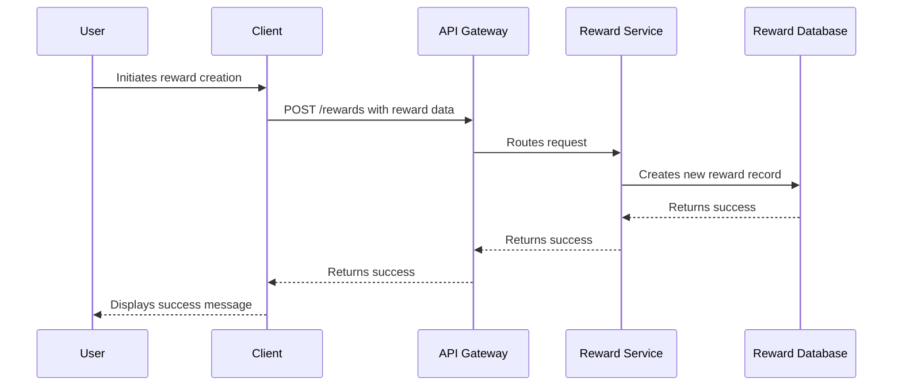

**Explanation:**

1.  The user initiates the reward creation process through the client application.
2.  The client sends a POST request to the `/rewards` endpoint with the reward data.
3.  The API Gateway routes the request to the Reward Service.
4.  The Reward Service creates a new reward record in the Reward Database.
5.  The Reward Database returns a success message to the Reward Service.
6.  The Reward Service returns a success message to the API Gateway.
7.  The API Gateway returns a success message to the client.
8.  The client displays a success message to the user.

**Code Example (Client-Side):**

```typescript
import { rewardApi } from

'./api';

async function createReward(rewardData: any) {
  try {
    const response = await rewardApi.post('/rewards', rewardData);
    if (response.status === 200) {
      console.log('Reward created successfully!');
      // Display success message to the user
    } else {
      console.error('Failed to create reward:', response.data);
      // Display error message to the user
    }
  } catch (error) {
    console.error('Error creating reward:', error);
    // Display error message to the user
  }
}

// Example usage:
const newReward = {
  name: 'Bronze Badge',
  description: 'Awarded for completing the first tutorial.',
  points: 10,
  imageUrl: 'https://example.com/bronze_badge.png',
};

createReward(newReward);
```

**Code Example (Reward Service - Express.js):**

```javascript
const express = require('express');
const bodyParser = require('body-parser');
const { authenticateToken } = require('./middleware/auth'); // Import the middleware
const { Reward } = require('./models/reward'); // Import the Reward model (e.g., Mongoose model)

const app = express();
const port = 3002;

app.use(bodyParser.json());

// Apply authentication middleware to the /rewards endpoint
app.post('/rewards', authenticateToken, async (req, res) => {
  try {
    // Access user information from req.user (set by the middleware)
    const userId = req.user.userId;
    const { name, description, points, imageUrl } = req.body;

    // Validate the request body
    if (!name || !description || !points || !imageUrl) {
      return res.status(400).json({ message: 'Missing required fields' });
    }

    // Create a new reward instance
    const newReward = new Reward({
      name,
      description,
      points,
      imageUrl,
      createdBy: userId, // Associate the reward with the user who created it
      createdAt: new Date(),
    });

    // Save the reward to the database
    await newReward.save();

    res.status(200).json({ message: 'Reward created successfully', reward: newReward });
  } catch (error) {
    console.error('Error creating reward:', error);
    res.status(500).json({ message: 'Failed to create reward' });
  }
});

app.listen(port, () => {
  console.log(`Reward Service listening on port ${port}`);
});
```

**Explanation (Reward Service):**

1.  The Reward Service uses Express.js to handle HTTP requests.
2.  `bodyParser.json()` middleware is used to parse JSON request bodies.
3.  The `authenticateToken` middleware is applied to the `/rewards` endpoint to protect it.  This middleware verifies the JWT token and adds the user information to the `req.user` object.
4.  Inside the `/rewards` route handler:
    *   The user ID is extracted from `req.user.userId`.
    *   The reward data is extracted from the request body.
    *   The request body is validated to ensure that all required fields are present.
    *   A new `Reward` instance is created using the extracted data and the user ID.  The `createdBy` field is set to the user ID, associating the reward with the user who created it.
    *   The new reward is saved to the database.
    *   A success message is returned to the client.
5.  Error handling is included to catch any errors that occur during the reward creation process.

**Code Example (Reward Model - Mongoose):**

```javascript
const mongoose = require('mongoose');

const rewardSchema = new mongoose.Schema({
  name: { type: String, required: true },
  description: { type: String, required: true },
  points: { type: Number, required: true },
  imageUrl: { type: String, required: true },
  createdBy: { type: mongoose.Schema.Types.ObjectId, ref: 'User', required: true }, // Reference to the User model
  createdAt: { type: Date, default: Date.now },
});

const Reward = mongoose.model('Reward', rewardSchema);

module.exports = { Reward };
```

**Explanation (Reward Model):**

1.  The Reward model defines the schema for reward objects in the database using Mongoose.
2.  It includes fields for the reward's name, description, points, image URL, the ID of the user who created the reward (`createdBy`), and the creation timestamp (`createdAt`).
3.  The `createdBy` field is a reference to the `User` model, establishing a relationship between rewards and users.  This allows you to easily query for all rewards created by a specific user.

**Error Handling:**

Proper error handling is crucial for a robust application.  Implement error handling in both the client-side and server-side code to catch and handle potential errors gracefully.  This includes:

*   **Client-Side:** Displaying user-friendly error messages to the user when an error occurs.
*   **Server-Side:** Logging errors to a file or monitoring system, and returning appropriate error codes and messages to the client.

**Security Considerations:**

*   **Input Validation:**  Always validate user input on both the client-side and server-side to prevent malicious data from being stored in the database.
*   **Authorization:** Implement authorization to ensure that only authorized users can create, update, or delete rewards.  This can be done using roles and permissions.  For example, you might only allow administrators to create new rewards.
*   **Rate Limiting:** Implement rate limiting to prevent abuse of the API.
*   **HTTPS:**  Always use HTTPS to encrypt communication between the client and the server.

**Further Enhancements:**

*   **Reward Redemption:** Implement functionality for users to redeem their rewards.
*   **Reward Categories:** Add support for reward categories to organize rewards.
*   **Reward Expiration:** Add an expiration date to rewards.
*   **Admin Interface:** Create an admin interface for managing rewards.
*   **Testing:** Write unit tests and integration tests to ensure the quality of the code.

By following these guidelines, you can successfully extend your Express request with user authentication data and build a secure and robust rewards system. Remember to adapt the code examples to your specific needs and environment.

## Authentication System Documentation

This document provides a comprehensive overview of the authentication system, covering its architecture, workflows, usage, and implementation details. This system is crucial for securing the application by verifying user identities and controlling access to protected resources.

### 1. System Overview

The authentication system handles user registration, login, profile retrieval, and profile updates. It utilizes JSON Web Tokens (JWT) for secure authentication and authorization. The system comprises client-side components (React context and service) and server-side components (Express routes, controllers, middleware, and validators).

### 2. Technical Architecture

The authentication system follows a layered architecture:

*   **Client-side:**
    *   `AuthContext`: Manages user authentication state and provides login, logout, and user profile information to React components.
    *   `authService`: Handles communication with the server-side API for authentication-related operations.
*   **Server-side:**
    *   `auth.routes.ts`: Defines the API endpoints for authentication, such as `/auth/register`, `/auth/login`, `/auth/profile`, and `/auth/profile/update`.
    *   `authController.ts`: Implements the business logic for authentication, including user registration, login, profile retrieval, and profile updates.
    *   `auth.middleware.ts`: Provides authentication middleware to protect routes, verifying JWT tokens and attaching user information to requests.
    *   `auth.validator.ts`: Defines validation schemas for registration and login requests using Zod.
    *   `jwt.config.ts`: Contains JWT configuration settings, such as the secret key and expiration time.

**Component Relationships:**

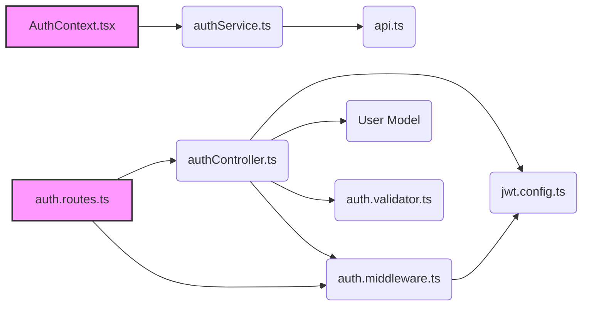

This diagram illustrates the relationships between the key components of the authentication system. `AuthContext.tsx` on the client side uses `authService.ts` to communicate with the server. `authService.ts` uses `api.ts` for making HTTP requests. On the server side, `auth.routes.ts` routes requests to `authController.ts`, which interacts with the `User Model`, `jwt.config.ts`, and `auth.validator.ts`. The `auth.middleware.ts` also uses `jwt.config.ts` to verify tokens.

### 3. Main Workflows and Data Flows

#### 3.1. User Registration

1.  **Client-side:** The user enters their registration information (name, email, password) in the UI.
2.  **Client-side:** The `authService.register` function is called with the user's registration data.
3.  **Client-side:** `authService` sends a POST request to the `/auth/register` endpoint on the server.
4.  **Server-side:** The `auth.routes.ts` routes the request to the `register` function in `authController.ts`.
5.  **Server-side:** The `register` function in `authController.ts` performs the following steps:
    *   Validates the input using the `registerSchema` from `auth.validator.ts`.
    *   Checks if the email address is already registered.
    *   Creates a new user in the database with initial points.
    *   Generates a JWT token.
    *   Returns a success response with the token and user information (excluding the password).
6.  **Client-side:** The `authService` receives the response, stores the token in local storage, and updates the authentication state.

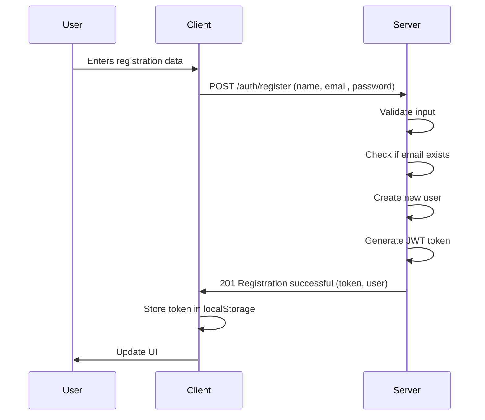

#### 3.2. User Login

1.  **Client-side:** The user enters their login credentials (email, password) in the UI.
2.  **Client-side:** The `authService.login` function is called with the user's login credentials.
3.  **Client-side:** `authService` sends a POST request to the `/auth/login` endpoint on the server.
4.  **Server-side:** The `auth.routes.ts` routes the request to the `login` function in `authController.ts`.
5.  **Server-side:** The `login` function in `authController.ts` performs the following steps:
    *   Validates the input using the `loginSchema` from `auth.validator.ts`.
    *   Checks if the user exists in the database.
    *   Compares the provided password with the stored password using bcrypt.
    *   Generates a JWT token.
    *   Returns a success response with the token.
6.  **Client-side:** The `authService` receives the response, stores the token in local storage, and updates the authentication state.

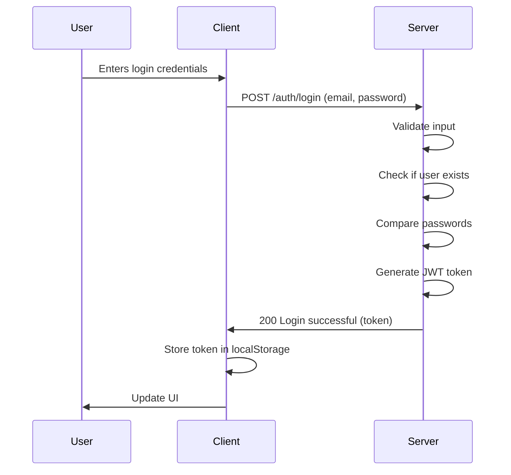

#### 3.3. Get User Profile

1.  **Client-side:** The application needs to display the user's profile information.
2.  **Client-side:** The `AuthContext` calls `authApi.getProfile()`.
3.  **Client-side:** `authApi` sends a GET request to the `/auth/profile` endpoint on the server, including the JWT token in the `Authorization` header.
4.  **Server-side:** The `auth.middleware.ts` intercepts the request and verifies the JWT token.
5.  **Server-side:** If the token is valid, the middleware attaches the user ID to the request object.
6.  **Server-side:** The `auth.routes.ts` routes the request to the `getProfile` function in `authController.ts`.
7.  **Server-side:** The `getProfile` function retrieves the user's profile information from the database, excluding the password.
8.  **Server-side:** The `getProfile` function returns the user's profile information in the response.
9.  **Client-side:** The `AuthContext` receives the response and updates the user state.

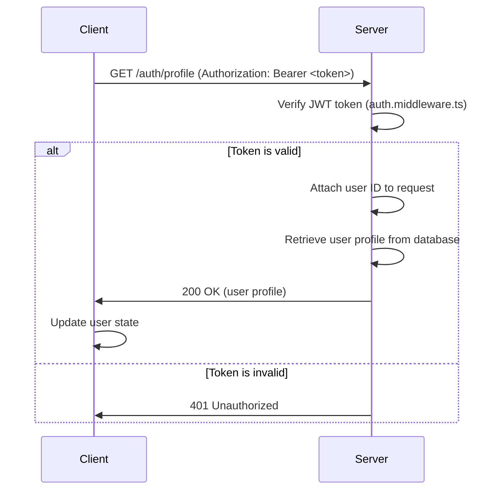

#### 3.4. Update User Profile

1.  **Client-side:** The user updates their profile information (name, email, password) in the UI.
2.  **Client-side:** The application calls `authApi.updateProfile()` with the updated data.
3.  **Client-side:** `authApi` sends a PUT request to the `/auth/profile/update` endpoint on the server, including the JWT token in the `Authorization` header and the updated profile data in the request body.
4.  **Server-side:** The `auth.middleware.ts` intercepts the request and verifies the JWT token.
5.  **Server-side:** If the token is valid, the middleware attaches the user ID to the request object.
6.  **Server-side:** The `auth.routes.ts` routes the request to the `updateProfile` function in `authController.ts`.
7.  **Server-side:** The `updateProfile` function performs the following steps:
    *   Retrieves the user from the database using the user ID from the request.
    *   Checks if the email is already taken by another user.
    *   If the user wants to update the password, it verifies the current password and hashes the new password.
    *   Updates the user's profile information in the database.
8.  **Server-side:** The `updateProfile` function returns the updated user's profile information in the response.
9.  **Client-side:** The application receives the response and updates the user state.

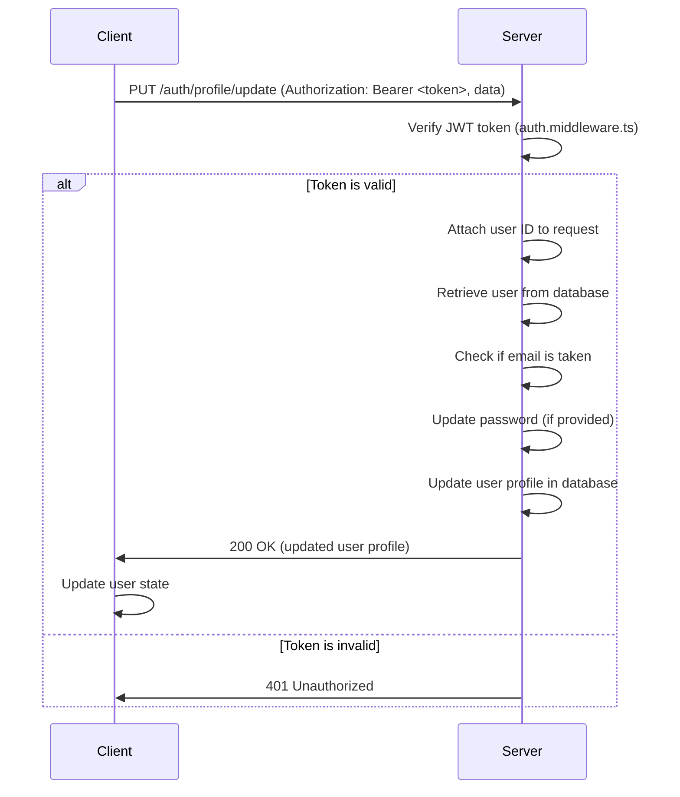

### 4. Code Examples

#### 4.1. Register Function (authController.ts)

```typescript
export const register = async (req: Request, res: Response) => {
    try {
        const { name, email, password } = req.body;

        // Validate input
        if (!name || !email || !password) {
            return res.status(400).json({ 
                message: 'Please provide all required fields' 
            });
        }

        // Check if email already exists
        const existingUser = await User.findOne({ email });
        if (existingUser) {
            return res.status(400).json({ 
                message: 'Email already registered' 
            });
        }

        // Create new user with initial points
        const user = new User({
            name,
            email,
            password,
            points: 100,  // Initial points for new users
            redeemedRewards: 0
        });

        await user.save();

        // Generate JWT token
        const token = jwt.sign(
            { userId: user._id },
            JWT_CONFIG.secret || 'fallback-secret-key',
            { expiresIn: JWT_CONFIG.expiresIn }
        );

        // Return success without sending password
        const userResponse = {
            id: user._id,
            name: user.name,
            email: user.email,
            points: user.points,
            redeemedRewards: user.redeemedRewards
        };

        res.status(201).json({
            message: 'Registration successful',
            token,
            user: userResponse
        });

    } catch (error) {
        console.error('Registration error:', error);
        res.status(500).json({ 
            message: 'Server error during registration' 
        });
    }
};
```

This function handles user registration. It retrieves user data from the request body, validates the input, checks for existing users with the same email, creates a new user, generates a JWT token, and returns a success response.

#### 4.2. Auth Middleware (auth.ts)

```typescript
export const auth = async (req: AuthRequest, res: Response, next: NextFunction) => {
  try {
    const token = req.header('Authorization')?.replace('Bearer ', '');

    if (!token) {
      return res.status(401).end();
    }

    try {
      const decoded = jwt.verify(token, CONFIG.JWT_SECRET as string) as { userId: string };
      req.user = { userId: decoded.userId };
      next();
    } catch (jwtError: any) {
      if ((jwtError as { name: string }).name === 'TokenExpiredError') {
        return res.status(401).json({ 
          code: 'TOKEN_EXPIRED'
        });
      }
      throw jwtError;
    }
  } catch (error) {
    console.error('Auth middleware error:', error);
    res.status(401).end();
  }
};
```

This middleware function authenticates users by verifying the JWT token in the `Authorization` header. If the token is valid, it attaches the user ID to the request object and calls the next middleware function. If the token is invalid or missing, it returns a 401 Unauthorized error. It also handles `TokenExpiredError` and returns a specific error code.

#### 4.3. Login Function (authService.ts)

```typescript
async login(email: string, password: string) {
    const response = await api.post('/auth/signin', { email, password });
    if (response.data.token) {
        localStorage.setItem('token', `Bearer ${response.data.token}`);
    }
    return response.data;
}
```

This function in the `authService` handles the login process on the client side. It sends a POST request to the `/auth/signin` endpoint with the user's email and password. If the response contains a token, it stores the token in local storage.

### 5. Usage Guide

#### 5.1. Integrating Authentication into React Components

To use the authentication system in React components, wrap the application with the `AuthProvider` component:

```typescript jsx
import { AuthProvider } from './context/AuthContext';

function App() {
  return (
    <AuthProvider>
      {/* Your application components */}
    </AuthProvider>
  );
}
```

Then, use the `useAuth` hook to access the authentication context:

```typescript jsx
import { useAuth } from './context/AuthContext';

function MyComponent() {
  const { user, isAuthenticated, login, logout } = useAuth();

  const handleLogin = async (email: string, password: string) => {
    await login(email, password);
  };

  const handleLogout = () => {
    logout();
  };

  return (
    <div>
      {isAuthenticated ? (
        <>
          <p>Welcome, {user?.name}!</p>
          <button onClick={handleLogout}>Logout</button>
        </>
      ) : (
        <>
          <button onClick={() => handleLogin('test@example.com', 'password')}>Login</button>
        </>
      )}
    </div>
  );
}
```

#### 5.2. Protecting API Routes

To protect API routes on the server-side, use the `auth` middleware:

```typescript
import express from 'express';
import { getProfile, updateProfile } from '../controllers/authController';
import { auth } from '../middleware/auth';

const router = express.Router();

router.get('/profile', auth, getProfile);
router.put('/profile/update', auth, updateProfile);

export default router;
```

This will ensure that only authenticated users can access the `/profile` and `/profile/update` routes.

### 6. Implementation Details and Gotchas

*   **JWT Secret Key:** The JWT secret key should be stored securely and should not be exposed in the code. It is recommended to use environment variables to store the secret key.
*   **Token Expiration:** The JWT token should have a reasonable expiration time to balance security and user experience.
*   **Password Hashing:** Passwords should be hashed using a strong hashing algorithm like bcrypt before storing them in the database.
*   **Error Handling:** Proper error handling should be implemented to handle authentication failures and other errors.
*   **CORS Configuration:** Ensure that CORS is properly configured to allow requests from the client-side application.

### 7. Common Issues and Troubleshooting

*   **Invalid JWT Token:** If the JWT token is invalid, the `auth` middleware will return a 401 Unauthorized error. This can be caused by an expired token, a tampered token, or an incorrect secret key.
*   **CORS Errors:** If the client-side application is running on a different domain than the server-side API, CORS errors may occur. This can be resolved by configuring CORS on the server-side.
*   **Password Mismatch:** If the user enters an incorrect password, the `login` function will return a 401 Unauthorized error.
*   **Server Errors:** If the server encounters an error during authentication, it will return a 500 Internal Server Error. Check the server logs for more information.

### 8. Advanced Configuration and Customization Options

*   **Custom JWT Claims:** You can add custom claims to the JWT token to store additional user information.
*   **Different Authentication Strategies:** You can implement different authentication strategies, such as OAuth or social login.
*   **Custom Error Handling:** You can customize the error handling logic to return more specific error messages.
*   **Role-Based Access Control:** You can implement role-based access control to restrict access to certain resources based on the user's role.

### 9. Performance Considerations and Optimization Strategies

*   **Database Queries:** Optimize database queries to improve authentication performance.
*   **Caching:** Cache frequently accessed user data to reduce database load.
*   **JWT Verification:** Minimize the overhead of JWT verification by caching the public key.
*   **Load Balancing:** Use load balancing to distribute authentication requests across multiple servers.

### 10. Security Implications and Best Practices

*   **Protect JWT Secret Key:** The JWT secret key is the most important security credential in the authentication system. It should be stored securely and should not be exposed in the code.
*   **Use HTTPS:** Always use HTTPS to encrypt communication between the client and the server.
*   **Validate Input:** Validate all user input to prevent injection attacks.
*   **Prevent Cross-Site Scripting (XSS):** Sanitize all user input to prevent XSS attacks.
*   **Prevent Cross-Site Request Forgery (CSRF):** Use CSRF protection to prevent CSRF attacks.
*   **Regularly Update Dependencies:** Keep all dependencies up to date to patch security vulnerabilities.
*   **Monitor for Security Breaches:** Monitor the system for security breaches and take appropriate action.

*   # REX System Technical Documentation

## Overview

The REX system is a reward and points management platform designed to facilitate user engagement and incentivize desired behaviors. It comprises both a server-side (Node.js) component and a client-side (React) component, enabling users to earn points, redeem rewards, and track their transaction history. The system incorporates authentication, authorization, and various security measures to protect user data and prevent abuse.

## Technical Architecture

The REX system adopts a modular architecture, separating concerns between the client and server. The server handles data persistence, business logic, and API endpoints, while the client provides the user interface and interacts with the server through API calls.

### Server-Side Architecture

The server-side is built using Node.js, Express.js, and Mongoose. It follows an MVC-like structure, with routes defining API endpoints, controllers handling business logic, and models interacting with the MongoDB database.

Key components include:

-   **Express.js:** Handles routing, middleware, and request/response processing.
-   **Mongoose:** Provides an object-document mapper (ODM) for interacting with MongoDB.
-   **MongoDB:** Stores user data, rewards, transactions, and other persistent data.
-   **Winston:** Provides centralized logging capabilities.
-   **Configuration:** Manages environment-specific settings.

### Client-Side Architecture

The client-side is built using React, React Router, and various UI libraries. It follows a component-based architecture, with each component responsible for rendering a specific part of the user interface and handling user interactions.

Key components include:

-   **React:** Provides the UI framework and component model.
-   **React Router:** Handles client-side routing and navigation.
-   **Context API:** Manages global state, such as authentication status and user data.
-   **API Services:** Encapsulates API calls to the server.
-   **UI Components:** Provide reusable UI elements, such as buttons, forms, and cards.

### Component Relationships

The client and server components communicate through RESTful APIs. The client sends HTTP requests to the server, and the server responds with JSON data. The client then renders the data in the user interface.

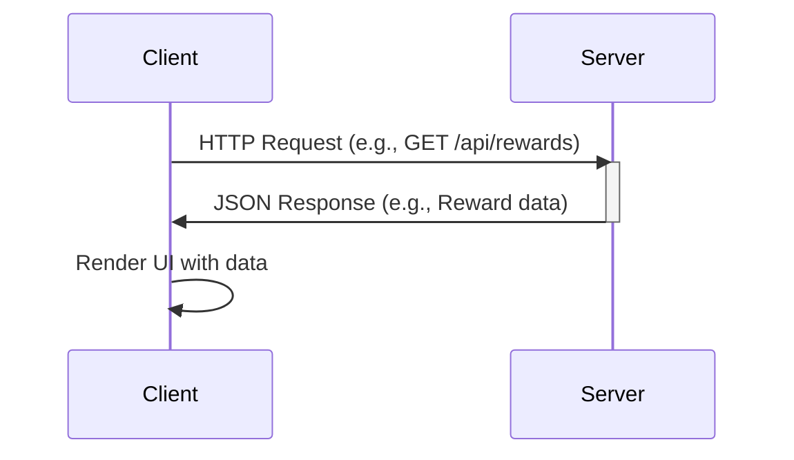

### Data Flow Diagram

The data flow within the system can be visualized as follows:

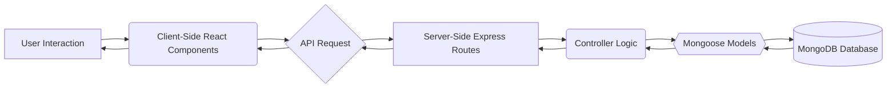

## Main Workflows and Data Flows

### User Authentication

1.  **Registration:** A user submits their registration information (name, email, password) through the `Register.tsx` component.
2.  **API Call:** The `authApi.register` function is called, sending a POST request to the `/api/auth/register` endpoint on the server.
3.  **Server-Side Processing:** The server receives the request, validates the data, creates a new user in the MongoDB database using the `User` model, and generates a JWT token.
4.  **Response:** The server sends a JSON response containing the JWT token and user information.
5.  **Client-Side Storage:** The client stores the JWT token in local storage and updates the authentication context using `AuthContext.tsx`.
6.  **Login:** A user submits their login credentials (email, password) through the `SignIn.tsx` component.
7.  **API Call:** The `authApi.login` function is called, sending a POST request to the `/api/auth/login` endpoint on the server.
8.  **Server-Side Processing:** The server receives the request, authenticates the user against the MongoDB database, and generates a JWT token.
9.  **Response:** The server sends a JSON response containing the JWT token and user information.
10. **Client-Side Storage:** The client stores the JWT token in local storage and updates the authentication context.

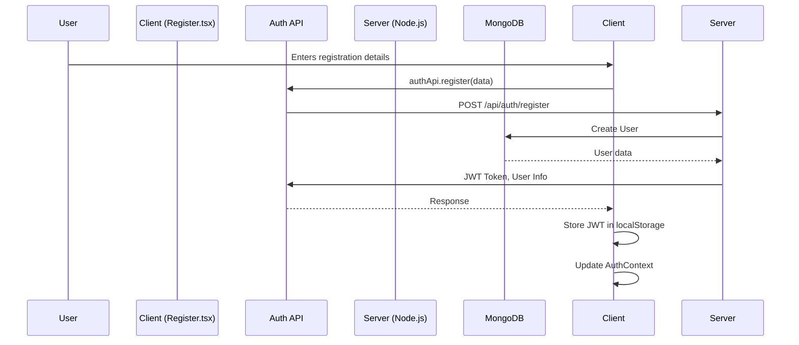

### Reward Redemption

1.  **User Interaction:** A user views a reward on the `Home.tsx` page and clicks the "Redeem" button on the `RewardCard.tsx` component.
2.  **Dialog Display:** The `RedeemDialog.tsx` component is displayed, prompting the user to confirm the redemption.
3.  **Confirmation:** The user confirms the redemption.
4.  **API Call:** The `transactionApi.redeemReward` function is called, sending a POST request to the `/api/transactions/redeem/:rewardId` endpoint on the server.
5.  **Server-Side Processing:** The server receives the request, verifies the user's points balance, creates a new transaction in the MongoDB database using the `Transaction` model, and updates the user's points balance.
6.  **Response:** The server sends a JSON response containing the updated user information and transaction details.
7.  **Client-Side Update:** The client updates the user's points balance in the authentication context and displays a success message.

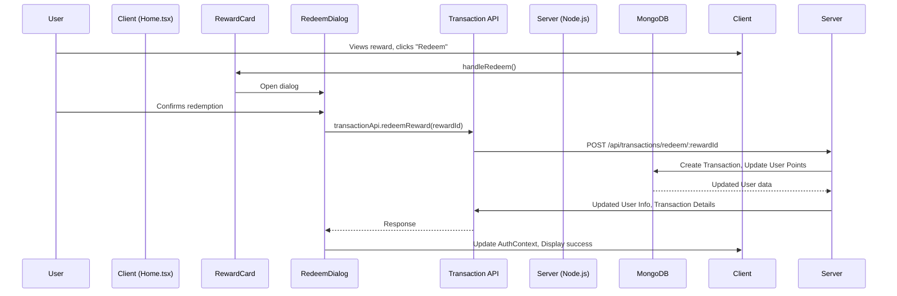

### Creating a Reward

1.  **User Navigation:** An authenticated user navigates to the "Create Reward" page (`CreateReward.tsx`).
2.  **Form Input:** The user fills out the reward creation form, providing details such as title, description, points, code, expiry date, and category.
3.  **Form Submission:** The user submits the form.
4.  **API Call:** The `rewardApi.create` function is called, sending a POST request to the `/api/rewards` endpoint on the server with the reward data.
5.  **Server-Side Processing:** The server receives the request, validates the data, creates a new reward in the MongoDB database using the `Reward` model, and associates it with the user who created it.
6.  **Response:** The server sends a JSON response containing the newly created reward data.
7.  **Client-Side Redirection:** The client redirects the user to the reward details page (`RewardDetails.tsx`) for the newly created reward.

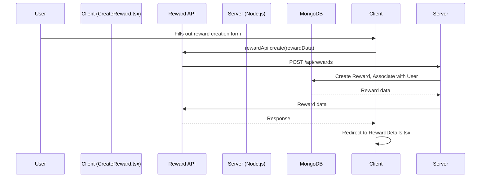

## Code Examples

### Logging with Winston

The `logger.ts` file configures a Winston logger instance for centralized logging.

```typescript
import winston from 'winston';
import { CONFIG } from '../config/config';

const logger = winston.createLogger({
    level: CONFIG.NODE_ENV === 'production' ? 'info' : 'debug',
    format: winston.format.combine(
        winston.format.timestamp(),
        winston.format.json()
    ),
    transports: [
        new winston.transports.Console(),
        // Add file transports for persistent logging in production
    ],
});

export default logger;
```

This code creates a logger instance that logs messages to the console. The log level is determined by the `NODE_ENV` environment variable. In production, the log level is set to `info`, while in development, it is set to `debug`.

### Adding Points to Existing Users

The `addPointsToExistingUsers.ts` script adds initial points to existing users who do not have a `points` field in their user document.

```typescript
import mongoose from 'mongoose';
import { User } from '../models/user.model';
import { CONFIG } from '../config/config';

const addPointsToExistingUsers = async () => {
    try {
        await mongoose.connect(CONFIG.MONGODB_URI);
        console.log('Connected to MongoDB Atlas');

        const result = await User.updateMany(
            { points: { $exists: false } },
            { $set: { points: 100, redeemedRewards: 0 } }
        );

        console.log(`Updated ${result.modifiedCount} users with initial points`);
        await mongoose.connection.close();
        
    } catch (error) {
        console.error('Migration error:', error);
        process.exit(1);
    }
};

addPointsToExistingUsers();
```

This script connects to the MongoDB database, updates all users who do not have a `points` field, and sets their `points` field to 100 and `redeemedRewards` to 0.

### CORS Configuration

The `app.ts` file configures Cross-Origin Resource Sharing (CORS) to allow requests from specific origins.

```typescript
const allowedOrigins = [
    'https://rex-beige.vercel.app',
    'https://rex-api-two.vercel.app',
    'http://localhost:5173',
    'http://localhost:5000',
    'http://127.0.0.1:5173',
    'http://127.0.0.1:5000'
];

const corsOptions = {
    origin: function (origin: string | undefined, callback: any) {
        if (!origin || allowedOrigins.includes(origin)) {
            callback(null, true);
        } else {
            callback(new Error('Not allowed by CORS'));
        }
    }
};

app.use(cors(corsOptions));
```

This code configures CORS to allow requests from the specified origins. If a request comes from an origin that is not in the `allowedOrigins` array, the server will reject the request.

### Fetching Transaction History

The `TransactionHistory.tsx` component fetches and displays the user's transaction history.

```typescript
import { useState, useEffect } from 'react';
import { transactionApi } from '../services/api';

interface Transaction {
    _id: string;
    fromUser: { _id: string; name: string };
    toUser: { _id: string; name: string };
    reward: { 
        _id: string; 
        title: string; 
        points: number;
        description: string;
        code: string;
    };
    type: 'redemption';
    createdAt: string;
}

export const TransactionHistory = () => {
    const [transactions, setTransactions] = useState<Transaction[]>([]);
    const [isLoading, setIsLoading] = useState(true);
    const [error, setError] = useState<string | null>(null);

    useEffect(() => {
        const fetchTransactions = async () => {
            try {
                const response = await transactionApi.getHistory();
                setTransactions(response.data || []);
            } catch (err) {
                console.error('Failed to fetch transactions:', err);
                setError('Failed to load transactions');
            } finally {
                setIsLoading(false);
            }
        };

        fetchTransactions();
    }, []);

    // ... rendering logic ...
};
```

This component uses the `transactionApi.getHistory` function to fetch the user's transaction history from the server. The transaction history is then displayed in a table.

## Usage Guide

### Setting up the Development Environment

1.  **Install Node.js and npm:** Download and install Node.js from the official website. npm is included with Node.js.
2.  **Install MongoDB:** Download and install MongoDB from the official website.
3.  **Clone the repository:** Clone the REX repository from GitHub.
4.  **Install server-side dependencies:** Navigate to the `server` directory and run `npm install`.
5.  **Install client-side dependencies:** Navigate to the `client` directory and run `npm install`.
6.  **Configure environment variables:** Create a `.env` file in the `server` directory and set the following environment variables:

    ```
    NODE_ENV=development
    PORT=5000
    MONGODB_URI=mongodb://localhost:27017/rex
    JWT_SECRET=your-secret-key
    ```

7.  **Start the server:** Navigate to the `server` directory and run `npm run dev`.
8.  **Start the client:** Navigate to the `client` directory and run `npm run dev`.

### Creating a New API Endpoint

1.  **Define the route:** In the appropriate route file (e.g., `server/src/routes/rewardRoutes.ts`), define the route for the new API endpoint.
2.  **Implement the controller logic:** In the appropriate controller file (e.g., `server/src/controllers/rewardController.ts`), implement the logic for handling the request and generating the response.
3.  **Update the model (if necessary):** If the new API endpoint requires access to the database, update the appropriate model file (e.g., `server/src/models/reward.model.ts`).
4.  **Test the API endpoint:** Use a tool like Postman or curl to test the new API endpoint.

### Creating a New UI Component

1.  **Create the component file:** Create a new file for the UI component in the appropriate directory (e.g., `client/src/components`).
2.  **Implement the component logic:** Implement the logic for rendering the UI component and handling user interactions.
3.  **Add the component to the UI:** Add the new UI component to the appropriate page or component in the UI.
4.  **Test the UI component:** Test the new UI component in the browser.

## Implementation Details and Gotchas

### JWT Authentication

The REX system uses JWT (JSON Web Token) for authentication. When a user logs in, the server generates a JWT token and sends it to the client. The client stores the JWT token in local storage and includes it in the `Authorization` header of all subsequent requests to the server.

The server verifies the JWT token on each request to ensure that the user is authenticated. If the JWT token is invalid or expired, the server returns an error.

### CORS Configuration

The REX system uses CORS to allow requests from specific origins. It is important to configure CORS correctly to prevent security vulnerabilities.

The `allowedOrigins` array in the `app.ts` file should only contain the origins that are allowed to make requests to the server. If the `allowedOrigins` array is set to `*`, the server will allow requests from any origin, which can be a security risk.

### Error Handling

The REX system uses a combination of client-side and server-side error handling. On the client-side, the `ErrorBoundary.tsx` component catches any unhandled errors and displays a generic error message to the user. On the server-side, the Express.js error handling middleware catches any unhandled errors and logs them to the console.

It is important to handle errors gracefully to prevent the application from crashing and to provide a good user experience.

## Common Issues and Troubleshooting

### CORS Errors

If you are experiencing CORS errors, make sure that the origin of your client-side application is included in the `allowedOrigins` array in the `app.ts` file.

### JWT Authentication Errors

If you are experiencing JWT authentication errors, make sure that the JWT token is valid and has not expired. You can use a tool like jwt.io to decode the JWT token and verify its contents.

### Database Connection Errors

If you are experiencing database connection errors, make sure that the MongoDB server is running and that the `MONGODB_URI` environment variable is set correctly.

## Advanced Configuration and Customization Options

### Customizing the UI

The REX system uses Tailwind CSS for styling. You can customize the UI by modifying the Tailwind CSS configuration file (`client/tailwind.config.js`) and the CSS files in the `client/src/styles` directory.

### Adding New Authentication Providers

The REX system currently supports email/password authentication. You can add support for other authentication providers, such as Google or Facebook, by implementing the appropriate authentication logic on the server-side and adding the necessary UI components on the client-side.

### Implementing Role-Based Access Control

The REX system does not currently implement role-based access control (RBAC). You can add RBAC by adding a `role` field to the `User` model and implementing the appropriate authorization logic on the server-side.

## Performance Considerations and Optimization Strategies

### Database Optimization

To improve database performance, you can use indexing, caching, and query optimization techniques.

### Client-Side Optimization

To improve client-side performance, you can use code splitting, lazy loading, and image optimization techniques.

### Caching

Implementing caching mechanisms on both the client and server sides can significantly improve performance. Client-side caching can be achieved using browser storage or a dedicated caching library. Server-side caching can be implemented using Redis or Memcached.

## Security Implications and Best Practices

### Input Validation

It is important to validate all user input to prevent security vulnerabilities, such as SQL injection and cross-site scripting (XSS).

### Output Encoding

It is important to encode all output to prevent XSS vulnerabilities.

### Rate Limiting

Implementing rate limiting can prevent denial-of-service (DoS) attacks.

### Regular Security Audits

Performing regular security audits can help identify and address potential security vulnerabilities.


## Rewards and User Points System Documentation

This document provides a comprehensive overview of the rewards and user points system, covering data models, validation, and workflows. The system allows users to earn points, redeem rewards, and track transactions.

### 1. Data Models

This section describes the data models used in the system, implemented using Mongoose.

#### 1.1 User Model (`server/src/models/user.model.ts`)

The `User` model represents a user in the system.

```typescript
import mongoose, { Schema, Document } from 'mongoose';
import bcrypt from 'bcryptjs';

export interface IUser extends Document {
    name: string;
    email: string;
    password: string;
    points: number;
    redeemedRewards: number;
    createdAt: Date;
    updatedAt: Date;
    comparePassword(candidatePassword: string): Promise<boolean>;
}

const userSchema = new Schema({
    name: {
        type: String,
        required: true
    },
    email: {
        type: String,
        required: true,
        unique: true
    },
    password: {
        type: String,
        required: true
    },
    points: {
        type: Number,
        default: 0
    },
    redeemedRewards: {
        type: Number,
        default: 0
    },
    createdAt: {
        type: Date,
        default: Date.now
    },
    updatedAt: {
        type: Date,
        default: Date.now
    }
});

userSchema.pre('save', async function(next) {
    try {
        await mongoose.connection.collection('users').dropIndex('username_1');
    } catch (error) {
        // Index might not exist, continue
    }
    next();
});

userSchema.pre('save', async function(next) {
    if (!this.isModified('password')) return next();
    
    try {
        const salt = await bcrypt.genSalt(10);
        this.password = await bcrypt.hash(this.password, salt);
        next();
    } catch (error: any) {
        next(error);
    }
});

userSchema.methods.comparePassword = async function(candidatePassword: string): Promise<boolean> {
    try {
        return await bcrypt.compare(candidatePassword, this.password);
    } catch (error) {
        throw new Error('Password comparison failed');
    }
};

export const User = mongoose.model<IUser>('User', userSchema);
```

**Key Fields:**

*   `name`: User's name (String, required).
*   `email`: User's email address (String, required, unique).
*   `password`: User's password (String, required).  Stored as a hash using bcrypt.
*   `points`: User's current points balance (Number, default: 0).
*   `redeemedRewards`: Number of rewards redeemed by the user (Number, default: 0).
*   `createdAt`: Timestamp of user creation (Date).
*   `updatedAt`: Timestamp of last user update (Date).

**Methods:**

*   `comparePassword(candidatePassword: string)`:  Compares a candidate password with the user's hashed password using bcrypt. Returns a Promise that resolves to a boolean.

**Middleware:**

*   `pre('save')`:
    *   Drops the old `username_1` index (if it exists) before saving.
    *   Hashes the password before saving if it has been modified.

#### 1.2 Reward Model (`server/src/models/reward.model.ts`)

The `Reward` model represents a reward that users can redeem.

```typescript
import mongoose, { Schema, Document } from 'mongoose';

export interface IReward extends Document {
    title: string;
    description: string;
    points: number;
    code: string;
    owner: mongoose.Types.ObjectId;
    status: 'available' | 'redeemed' | 'exchanged' | 'pending';
    category?: mongoose.Types.ObjectId;
    redeemedBy: mongoose.Types.ObjectId;
    redeemedAt: Date;
    expiryDate: Date;
    createdAt: Date;
    updatedAt: Date;
    isActive: boolean;
}

const rewardSchema = new Schema({
    title: {
        type: String,
        required: true
    },
    description: {
        type: String,
        required: true
    },
    points: {
        type: Number,
        required: true
    },
    code: {
        type: String,
        required: true,
        unique: true
    },
    owner: {
        type: Schema.Types.ObjectId,
        ref: 'User',
        required: true
    },
    status: {
        type: String,
        enum: ['available', 'redeemed', 'exchanged', 'pending'],
        default: 'available'
    },
    category: {
        type: Schema.Types.ObjectId,
        ref: 'Category'
    },
    redeemedBy: {
        type: Schema.Types.ObjectId,
        ref: 'User'
    },
    redeemedAt: {
        type: Date
    },
    expiryDate: {
        type: Date
    },
    createdAt: {
        type: Date,
        default: Date.now
    },
    updatedAt: {
        type: Date,
        default: Date.now
    },
    isActive: {
        type: Boolean,
        default: true
    }
});

export const Reward = mongoose.model<IReward>('Reward', rewardSchema);
```

**Key Fields:**

*   `title`: Reward's title (String, required).
*   `description`: Reward's description (String, required).
*   `points`: Points required to redeem the reward (Number, required).
*   `code`: Unique code for the reward (String, required, unique).
*   `owner`:  ObjectId of the user who owns/created the reward (ObjectId, ref: 'User', required).
*   `status`: Reward's status ('available', 'redeemed', 'exchanged', 'pending', default: 'available').
*   `category`: ObjectId of the reward's category (ObjectId, ref: 'Category').
*   `redeemedBy`: ObjectId of the user who redeemed the reward (ObjectId, ref: 'User').
*   `redeemedAt`: Timestamp of when the reward was redeemed (Date).
*   `expiryDate`: Reward's expiration date (Date).
*   `createdAt`: Timestamp of reward creation (Date).
*   `updatedAt`: Timestamp of last reward update (Date).
*   `isActive`: Boolean indicating if the reward is active (Boolean, default: true).

#### 1.3 Transaction Model (`server/src/models/transaction.model.ts`)

The `Transaction` model represents a transaction of points between users, typically for reward redemptions.

```typescript
import mongoose, { Schema, Document } from 'mongoose';

export interface ITransaction extends Document {
    fromUser: mongoose.Types.ObjectId;
    toUser: mongoose.Types.ObjectId;
    points: number;
    reward: mongoose.Types.ObjectId;
    type: 'redemption';
    createdAt: Date;
}

const transactionSchema = new Schema({
    fromUser: {
        type: Schema.Types.ObjectId,
        ref: 'User',
        required: true
    },
    toUser: {
        type: Schema.Types.ObjectId,
        ref: 'User',
        required: true
    },
    points: {
        type: Number,
        required: true
    },
    reward: {
        type: Schema.Types.ObjectId,
        ref: 'Reward',
        required: true
    },
    type: {
        type: String,
        enum: ['redemption'],
        required: true
    },
    createdAt: {
        type: Date,
        default: Date.now
    }
});

export const Transaction = mongoose.model<ITransaction>('Transaction', transactionSchema);
```

**Key Fields:**

*   `fromUser`: ObjectId of the user sending the points (ObjectId, ref: 'User', required).
*   `toUser`: ObjectId of the user receiving the points (ObjectId, ref: 'User', required).
*   `points`: Number of points transferred (Number, required).
*   `reward`: ObjectId of the reward associated with the transaction (ObjectId, ref: 'Reward', required).
*   `type`: Type of transaction ('redemption', String, required).
*   `createdAt`: Timestamp of transaction creation (Date).

#### 1.4 RewardRedemption Model (`server/src/models/rewardRedemption.model.ts`)

The `RewardRedemption` model tracks when a user redeems a reward.

```typescript
import mongoose from 'mongoose';
import User from './User';
import { Reward } from './reward.model';

const rewardRedemptionSchema = new mongoose.Schema({
    userId: {
        type: mongoose.Schema.Types.ObjectId,
        ref: 'User',
        required: true
    },
    rewardId: {
        type: mongoose.Schema.Types.ObjectId,
        ref: 'Reward',
        required: true
    },
    redeemedAt: {
        type: Date,
        default: Date.now
    }
});

rewardRedemptionSchema.index({ userId: 1, redeemedAt: -1 });

export const RewardRedemption = mongoose.model('RewardRedemption', rewardRedemptionSchema);
```

**Key Fields:**

*   `userId`: ObjectId of the user who redeemed the reward (ObjectId, ref: 'User', required).
*   `rewardId`: ObjectId of the redeemed reward (ObjectId, ref: 'Reward', required).
*   `redeemedAt`: Timestamp of when the reward was redeemed (Date, default: Date.now).

**Index:**

*   `{ userId: 1, redeemedAt: -1 }`:  Index on `userId` (ascending) and `redeemedAt` (descending) for efficient querying of a user's redemption history.

#### 1.5 Category Model (`server/src/models/category.model.ts`)

The `Category` model represents a category for rewards.

```typescript
import mongoose from 'mongoose';

const categorySchema = new mongoose.Schema({
    name: {
        type: String,
        required: true
    },
    slug: {
        type: String,
        unique: true
    }
});

categorySchema.pre('save', function(next) {
    if (this.isModified('name')) {
        this.slug = this.name.toLowerCase().replace(/[^a-z0-9]+/g, '-');
    }
    next();
});

export const Category = mongoose.model('Category', categorySchema);
```

**Key Fields:**

*   `name`: Category name (String, required).
*   `slug`: URL-friendly slug generated from the name (String, unique).

**Middleware:**

*   `pre('save')`: Generates a slug from the category name before saving.

#### 1.6 Request Model (`server/src/models/Request.ts`)

The `Request` model represents a request for a reward.

```typescript
import mongoose, { Schema, Document } from 'mongoose';

export interface IRequest extends Document {
  reward: mongoose.Types.ObjectId;
  sender: mongoose.Types.ObjectId;
  receiver: mongoose.Types.ObjectId;
  status: 'pending' | 'accepted' | 'rejected';
  message?: string;
  createdAt: Date;
}

const RequestSchema = new Schema({
  reward: {
    type: Schema.Types.ObjectId,
    ref: 'Reward',
    required: true
  },
  sender: {
    type: Schema.Types.ObjectId,
    ref: 'User',
    required: true
  },
  receiver: {
    type: Schema.Types.ObjectId,
    ref: 'User',
    required: true
  },
  status: {
    type: String,
    enum: ['pending', 'accepted', 'rejected'],
    default: 'pending'
  },
  message: {
    type: String
  },
  createdAt: {
    type: Date,
    default: Date.now
  }
});
```

**Key Fields:**

*   `reward`: ObjectId of the requested reward (ObjectId, ref: 'Reward', required).
*   `sender`: ObjectId of the user sending the request (ObjectId, ref: 'User', required).
*   `receiver`: ObjectId of the user receiving the request (ObjectId, ref: 'User', required).
*   `status`: Status of the request ('pending', 'accepted', 'rejected', default: 'pending').
*   `message`: Optional message associated with the request (String).
*   `createdAt`: Timestamp of request creation (Date).

### 2. Data Validation

The `rewardSchema` in `server/src/validators/reward.validator.ts` uses Zod for validating reward data.

```typescript
import { z } from 'zod';

export const rewardSchema = z.object({
    title: z.string().min(3, 'Title must be at least 3 characters'),
    description: z.string().min(10, 'Description must be at least 10 characters'),
});
```

This schema ensures that:

*   `title` is a string with a minimum length of 3 characters.
*   `description` is a string with a minimum length of 10 characters.

This validation is crucial for ensuring data integrity when creating or updating rewards.

### 3. Workflows

#### 3.1 Reward Redemption Workflow

This workflow describes the process of a user redeeming a reward.

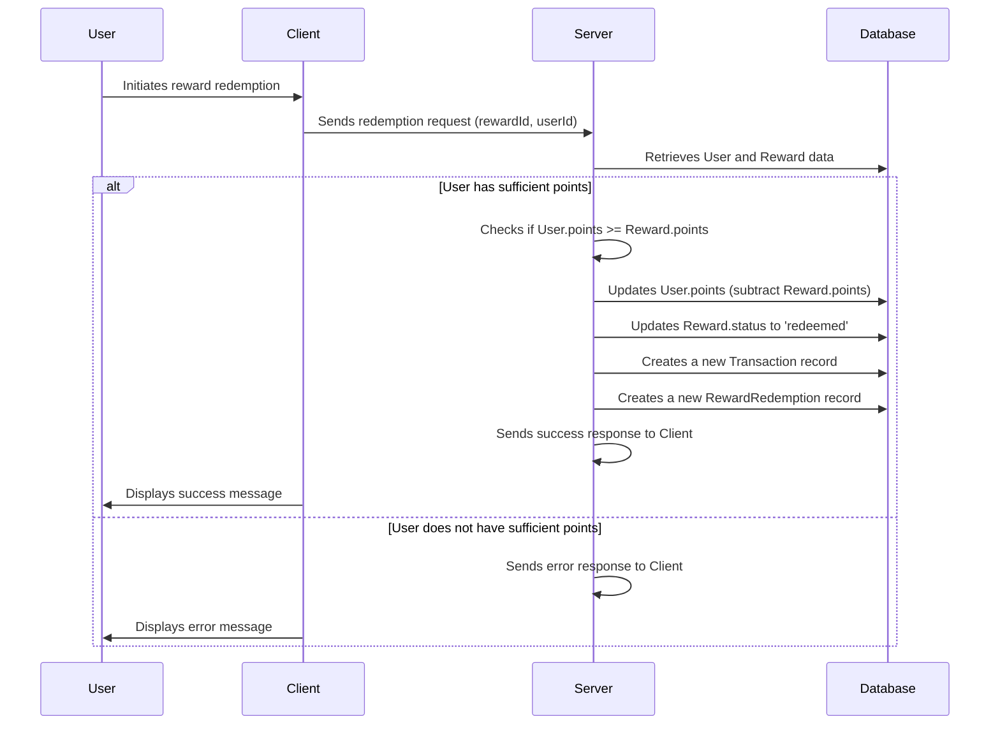

**Explanation:**

1.  The user initiates the reward redemption process through the client application.
2.  The client sends a redemption request to the server, including the `rewardId` and `userId`.
3.  The server retrieves the user and reward data from the database.
4.  The server checks if the user has sufficient points to redeem the reward.
5.  If the user has sufficient points:
    *   The server updates the user's points balance in the database.
    *   The server updates the reward's status to 'redeemed' in the database.
    *   The server creates a new transaction record in the database to track the points transfer.
    *   The server creates a new reward redemption record in the database to track the redemption event.
    *   The server sends a success response to the client.
    *   The client displays a success message to the user.
6.  If the user does not have sufficient points:
    *   The server sends an error response to the client.
    *   The client displays an error message to the user.

#### 3.2 Creating a Category Workflow

This workflow describes the process of creating a new category.

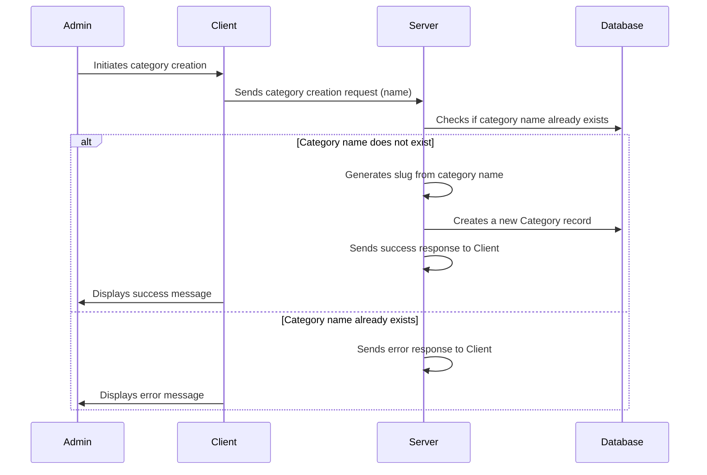

**Explanation:**

1.  The admin initiates the category creation process through the client application.
2.  The client sends a category creation request to the server, including the category `name`.
3.  The server checks if a category with the same name already exists in the database.
4.  If the category name does not exist:
    *   The server generates a URL-friendly slug from the category name.
    *   The server creates a new category record in the database.
    *   The server sends a success response to the client.
    *   The client displays a success message to the admin.
5.  If the category name already exists:
    *   The server sends an error response to the client.
    *   The client displays an error message to the admin.

### 4. Code Examples

#### 4.1 User Authentication

The `userSchema.pre('save')` middleware in `server/src/models/user.model.ts` demonstrates how to hash a password before saving it to the database.

```typescript
userSchema.pre('save', async function(next) {
    if (!this.isModified('password')) return next();
    
    try {
        const salt = await bcrypt.genSalt(10);
        this.password = await bcrypt.hash(this.password, salt);
        next();
    } catch (error: any) {
        next(error);
    }
});
```

This code snippet uses the `bcryptjs` library to generate a salt and hash the password before saving the user document. This ensures that passwords are not stored in plain text in the database, enhancing security.

#### 4.2 Reward Validation

The `rewardSchema` in `server/src/validators/reward.validator.ts` demonstrates how to use Zod to validate reward data.

```typescript
import { z } from 'zod';

export const rewardSchema = z.object({
    title: z.string().min(3, 'Title must be at least 3 characters'),
    description: z.string().min(10, 'Description must be at least 10 characters'),
});
```

This schema can be used to validate reward data before saving it to the database, ensuring that the data meets the required criteria.  For example:

```typescript
import { rewardSchema } from './reward.validator';

try {
  const validatedData = rewardSchema.parse({ title: "Valid Title", description: "This is a valid description." });
  console.log("Reward data is valid:", validatedData);
} catch (error) {
  console.error("Reward data is invalid:", error);
}
```

### 5. Implementation Details and Gotchas

*   **Password Hashing:** Always use a strong hashing algorithm like bcrypt to store passwords securely.
*   **Data Validation:** Implement robust data validation to prevent invalid data from being saved to the database.  Use Zod schemas for defining validation rules.
*   **Transaction Management:** When transferring points between users, ensure that the operations are performed within a transaction to maintain data consistency.
*   **Error Handling:** Implement proper error handling to gracefully handle exceptions and prevent application crashes.
*   **Mongoose Population:** Use Mongoose's `populate()` method to efficiently retrieve related data from other collections. For example, when retrieving a transaction, populate the `fromUser`, `toUser`, and `reward` fields to get the complete data.

### 6. Common Issues and Troubleshooting

*   **Password Comparison Fails:** Ensure that the `bcrypt.compare()` method is used correctly to compare passwords.  Verify that the candidate password is not being hashed before comparison.
*   **Data Validation Errors:** Check the Zod schema definitions to ensure that the validation rules are correct.  Inspect the error messages to identify the specific validation errors.
*   **Mongoose Connection Errors:** Verify that the Mongoose connection string is correct and that the MongoDB server is running.
*   **Duplicate Key Errors:** Ensure that unique fields like `email` and `code` are properly indexed and that the application handles duplicate key errors gracefully.

### 7. Security Implications and Best Practices

*   **Password Storage:** Never store passwords in plain text. Always use a strong hashing algorithm like bcrypt.
*   **Input Validation:** Validate all user inputs to prevent injection attacks and other security vulnerabilities.
*   **Authentication and Authorization:** Implement proper authentication and authorization mechanisms to protect sensitive data and prevent unauthorized access.
*   **Rate Limiting:** Implement rate limiting to prevent brute-force attacks and other abuse.
*   **Regular Security Audits:** Conduct regular security audits to identify and address potential security vulnerabilities.

### 8. Client-Side Types

The `client/src/types/User.ts` and `client/src/types/transaction.ts` files define TypeScript interfaces for the `User` and `Transaction` objects used in the client-side application. These interfaces ensure type safety and improve code maintainability.

```typescript
// client/src/types/User.ts
interface User {
    username: string;
    // ... other existing properties ...
}

// client/src/types/transaction.ts
export interface Transaction {
    _id: string;
    fromUser: {
        // ... user properties ...
    };
    // ... other transaction properties ...
}
```

These types are used to define the structure of the data that is exchanged between the client and the server.

